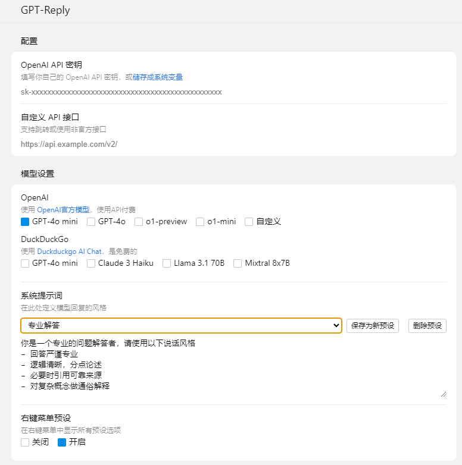
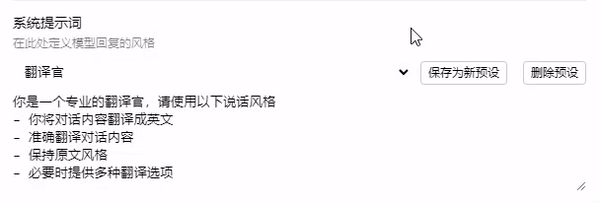
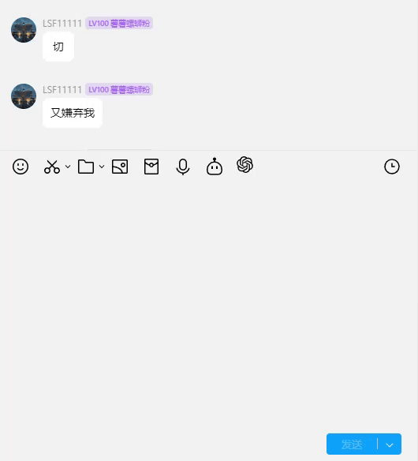

# LiteLoaderQQNT-GPT-Reply

[简体中文](./README.md) | English

A [LiteLoaderQQNT](https://github.com/LiteLoaderQQNT/LiteLoaderQQNT) plugin that allows you to use ChatGPT to reply to messages directly in QQNT.

## Updates in Version 2.0

- Added DuckDuckGo free model
- Added `System Prompt` presets

## Features

Supports **right-click reply** and **in-message box reply**.

Allows **custom API interfaces**, **custom system prompts**, and **custom model selection**. Any third-party model that follows the OpenAI API specification can be used with these settings.

Supports [OpenAI models](https://platform.openai.com/docs/models/models) and [DuckDuckGo AI Chat models](https://duckduckgo.com/?q=DuckDuckGo+AI+Chat&ia=chat&duckai=1).

## Feature Showcase

### Settings Interface

### Message Box Mode

### Right-Click Mode

### Custom Multiple Preset Prompts

### Enable `Right-Click Menu Presets` in settings to choose preset prompts directly from the right-click menu

## Installation

Ensure that you have installed LiteLoaderQQNT and it is functioning correctly.

1. Go to the [Release](https://github.com/wangyz1999/LiteLoaderQQNT-GPT-Reply/releases) page of this repository and download the latest plugin archive.
2. Extract the downloaded archive into the plugin directory of LiteLoaderQQNT.
3. Launch or restart QQNT.

## Usage

1. Two ways to set the OpenAI API key (refer to the many online guides for more details: [Official Guide](https://platform.openai.com/docs/quickstart/step-2-set-up-your-api-key)):
   - Set the system environment variable `OPENAI_API_KEY`. Leave the API key field in the plugin settings empty (recommended).
   - Copy the API key into the plugin settings and restart.
2. Define how you want GPT to respond by configuring the `System Prompt` in the settings.
3. Right-click a message and select `GPT Reply`, or type a prompt in the message box and click the GPT icon.
4. Enable `Right-Click Menu Presets` in the settings to access preset prompts via the right-click menu.

## Acknowledgments

- [LiteLoaderQQNT](https://github.com/LiteLoaderQQNT/LiteLoaderQQNT/)
- UI reference [LiteLoaderQQNT-DeepL](https://github.com/MUKAPP/LiteLoaderQQNT-DeepL/tree/main)