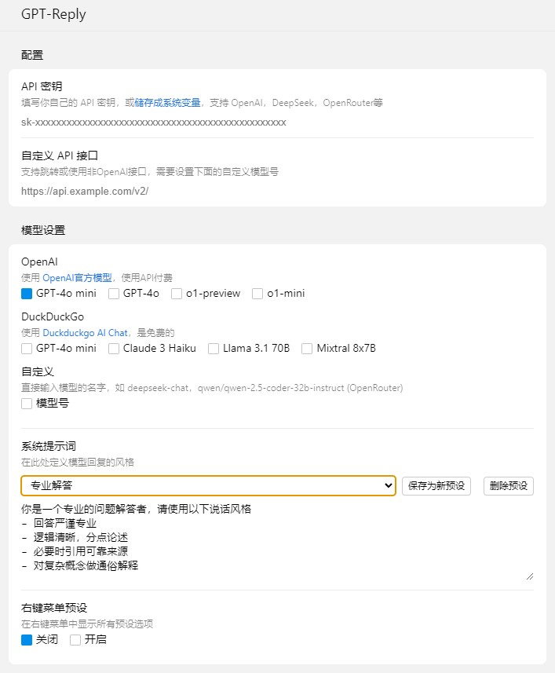
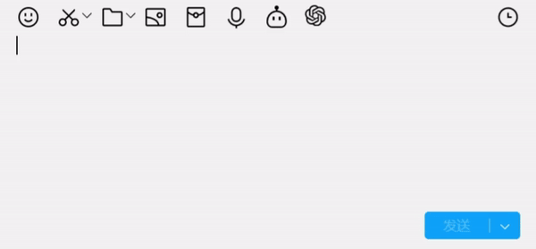
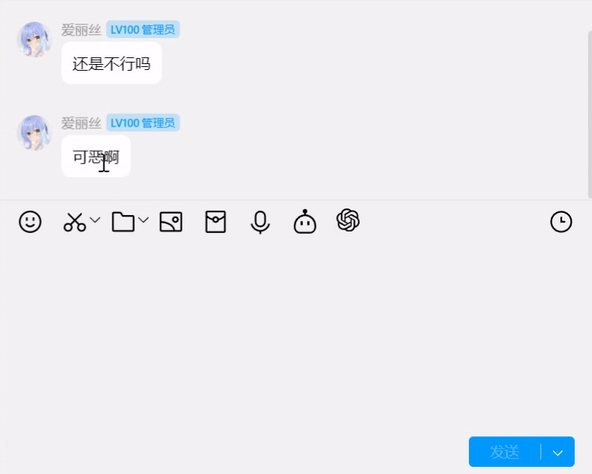

# LiteLoaderQQNT-GPT-Reply

简体中文 | [English](./README.en.md)

[LiteLoaderQQNT](https://github.com/LiteLoaderQQNT/LiteLoaderQQNT) 插件，直接在 QQNT 使用 ChatGPT 回复消息

支持 **右键回复** 和 **消息框内回复**

支持 **自定义API接口**，**自定义系统提示词** 和 **自选模型编号**

注：OpenAI GPT 模型并非免费，使用会根据官方价格在官方 API 界面扣费

## 功能展示

## 安装

请确保你已经安装了 LiteLoaderQQNT 并且能正常运作。

-   前往本仓库 [Release](https://github.com/wangyz1999/LiteLoaderQQNT-GPT-Reply/releases) 下载最新版的插件压缩包
-   将从本仓库 Release 中下载的压缩包解压至 LiteLoaderQQNT 的插件目录中
-   启动或重启 QQNT

## 使用方法

-   两种方法设置 OpenAI API 密钥。网上一堆教程：[官方英文教程](https://platform.openai.com/docs/quickstart/step-2-set-up-your-api-key)
    1. 设置系统环境变量`OPENAI_API_KEY`。设置里的 API 密钥可以留为空（推荐）
    2. 复制 API 密钥到插件设置中，然后重启
-   在设置 `系统提示词` 中定义你想要 GPT 怎么回复
-   右键消息选`GPT`回复，或在消息框内输入提示词然后点击 GPT 图标

## 鸣谢

-   [LiteLoaderQQNT](https://github.com/LiteLoaderQQNT/LiteLoaderQQNT/)
-   UI 参考[LiteLoaderQQNT-DeepL](https://github.com/MUKAPP/LiteLoaderQQNT-DeepL/tree/main)
